# Temple Monorepo: Comprehensive Architecture Analysis

**Date**: January 7, 2026  
**Scope**: Full system architecture review, dependency analysis, and refactoring recommendations

---

## 1. Architectural Model

### 1.1 System Overview

Temple is a **three-tier meta-templating system** designed for declarative transformation of structured data into text formats with real-time validation and developer tooling.


### 1.2 Component Roles & Responsibilities

#### **Component 1: temple/** - Core Templating Engine

**Status**: Active Development (Functional Core)  
**Language**: Python 3.8+  
**Primary Responsibility**: Authoritative tokenization and core template processing

**Roles**:

- **Authoritative Tokenizer**: Production-ready template tokenization with configurable delimiters
- **Token Model Definition**: Canonical `Token` class with (line, col) position tracking
- **Performance Optimizations**: LRU-cached regex pattern compilation for 10x+ speedup
- **Specification Authority**: Defines DSL syntax, query language semantics, error reporting strategy
- **Core Library**: Provides foundational components for temple-linter and other consumers

**Key Files**:

- [`src/temple/template_tokenizer.py`](temple/src/temple/template_tokenizer.py) - Authoritative tokenizer implementation
- [`src/temple/__init__.py`](temple/src/temple/__init__.py) - Package exports (Token, TokenType, temple_tokenizer)
- [`tests/test_tokenizer.py`](temple/tests/test_tokenizer.py) - Core tokenizer tests (10 passing)
- [`docs/ARCHITECTURE.md`](temple/docs/ARCHITECTURE.md) - Component diagram and data flow
- [`docs/syntax_spec.md`](temple/docs/syntax_spec.md) - DSL grammar with configurable delimiters
- [`docs/query_language_and_schema.md`](temple/docs/query_language_and_schema.md) - Dot notation & JMESPath specs
- [`docs/error_reporting_strategy.md`](temple/docs/error_reporting_strategy.md) - Error handling philosophy
- [`docs/data_format_parsers.md`](temple/docs/data_format_parsers.md) - Pluggable parser registry design

**Dependencies**: None (pure Python 3.8+ stdlib)

**Outputs**:

- Installable `temple` package
- Token class and tokenizer for downstream consumers
- Architecture specifications

---

#### **Component 2: temple-linter/** - LSP Server & Linting

**Status**: Active Development (Functional)  
**Language**: Python 3.8+  
**Primary Responsibility**: Template-aware linting and LSP server implementation

**Roles**:

- **Linting Orchestration**: Coordinates template linting using core tokenizer from `temple` package
- **Template Preprocessor**: Strips template tokens to expose base format for native linters
- **LSP Server**: Implements Language Server Protocol for editor integration
- **Diagnostic Mapper**: Maps diagnostics from cleaned content back to original template positions
- **Base Format Detector**: Identifies underlying format (JSON, HTML, YAML, etc.)

**Key Files**:

- **Services** (using temple core tokenizer):
  
- [`src/temple_linter/template_preprocessing.py`](temple-linter/src/temple_linter/template_preprocessing.py)
  - `strip_template_tokens()` - Removes DSL for base format linting
  - CLI interface for external linter integration
  
- [`src/temple_linter/lsp_server.py`](temple-linter/src/temple_linter/lsp_server.py)
  - `TempleLinterServer` class extending pygls `LanguageServer`
  - Handlers for `textDocument/didOpen`, `didChange`, `didSave`
  - Custom `temple/requestBaseDiagnostics` request to VS Code extension
  - Position mapping logic `_map_cleaned_pos_to_original()`
  
- [`src/temple_linter/diagnostics.py`](temple-linter/src/temple_linter/diagnostics.py)
  - `map_diagnostics()` - Combines template and base format diagnostics
  
- [`src/temple_linter/linter.py`](temple-linter/src/temple_linter/linter.py)
  - `TemplateLinter` class - Core linting logic
  - CLI entry point with `--delegate-base-lint` flag
  
- [`src/temple_linter/base_format_linter.py`](temple-linter/src/temple_linter/base_format_linter.py)
  - `BaseFormatLinter` - Detects format, strips tokens, delegates to format-specific linters
  - `detect_base_format()` - Extension and content-based detection

**Dependencies**:

- `temple>=0.1.0` - Core tokenization engine (REQUIRED)
- `pygls>=1.0.0` - LSP server framework

**Outputs**:

- LSP diagnostics for template files
- Cleaned content for base format linting
- Position-mapped diagnostics

---

#### **Component 3: vscode-temple-linter/** - VS Code Extension

**Status**: Functional Prototype  
**Language**: TypeScript / Node.js  
**Primary Responsibility**: VS Code integration via LSP proxy

**Roles**:

- **Extension Host**: Activates on `.tmpl`, `.template` files
- **LSP Client**: Connects to `temple-linter` Python LSP server
- **Virtual Document Provider**: Creates `temple-cleaned://` URIs for cleaned content
- **Diagnostic Proxy**: Routes diagnostic requests from Python LSP to VS Code's native linters
- **Position Translator**: Maps diagnostics between cleaned and original documents

**Key Files**:

- [`src/extension.ts`](vscode-temple-linter/src/extension.ts) - Main extension entry point
  - `activate()` - Starts Python LSP server, registers handlers
  - `handleCreateVirtualDocument()` - Stores cleaned content in memory
  - `getDiagnosticsForCleanedContent()` - Virtual doc or temp file fallback
  - `vscDiagToLspDiag()` - Converts VS Code to LSP diagnostic format
  - LSP proxy server for `temple/requestBaseDiagnostics`

- [`package.json`](vscode-temple-linter/package.json)
  - Language definition: `templ-any` for `.tmpl`, `.template`
  - Extension activation events
  - Dependencies: `vscode-languageclient`, `vscode-languageserver`

- [`ARCHITECTURE.md`](vscode-temple-linter/ARCHITECTURE.md)
  - Sequence diagrams for LSP communication
  - Architecture diagrams showing data flow

**Dependencies**:

- `vscode-languageclient@^9.0.1` - LSP client library
- `vscode-languageserver@^8.0.0` - LSP server types
- `typescript@^4.8.0` - Build toolchain

**Outputs**:

- Real-time diagnostics in VS Code editor
- Integration with VS Code's native linters (JSON, Markdown, HTML, etc.)

---

### 1.3 Data Flow Architecture

```mermaid
flowchart TD
  user["User edits .tmpl in VS Code"] --> ext["vscode-temple-linter (Extension)\n• Intercepts file changes\n• Sends document to Python LSP"]
  ext -->|LSP: textDocument/didChange| lsp["temple-linter (Python LSP)\n1) Tokenize\n2) Lint template\n3) Strip tokens\n4) Send cleaned content"]
  lsp -->|temple/requestBaseDiagnostics| proxy["vscode-temple-linter (Diagnostic Proxy)\n1) Create virtual doc (temple-cleaned://)\n2) Trigger native linters\n3) Collect diagnostics\n4) Convert to LSP"]
  proxy --> native["VS Code native linters\nJSON / YAML / HTML / etc."]
  native --> proxy
  proxy --> mapper["temple-linter (Position Mapper)\n1) Map cleaned → original\n2) Merge template + base\n3) Publish combined diagnostics"]
  mapper --> editor["VS Code editor\n• Squiggles in original file\n• Problems panel entries"]
```



---

### 1.4 Critical Integration Points

1. **temple → temple-linter**:
   - Shared delimiter configuration schema
   - Position tracking conventions `(line, col)` tuples
   - Error reporting format (inline + actionable)

2. **temple-linter → vscode-temple-linter**:
   - Custom LSP notification: `temple/createVirtualDocument`
   - Custom LSP request: `temple/requestBaseDiagnostics`
   - Diagnostic position mapping protocol

3. **vscode-temple-linter → VS Code Native Linters**:
   - Virtual document URIs: `temple-cleaned://`
   - Fallback to temp files if virtual docs fail
   - Environment variable `TEMPLE_LINTER_FORCE_TEMP`

---

## 2. Dependency Isolation Analysis

### 2.1 Python Projects (`temple/`, `temple-linter/`)

#### Current State: ✅ PROPERLY ISOLATED

**temple/**:

- Virtual environment: `.venv/` (local to `temple/`)
- Dependencies: `requirements.txt` (currently empty - spec only)
- Package config: `pyproject.toml` with `setuptools` build system
- No runtime dependencies on `temple-linter`

**temple-linter/**:

- Virtual environment: `.venv/` (local to `temple-linter/`)
- Dependencies: `requirements.txt` → `temple>=0.1.0`, `pygls>=1.0.0`
- Package config: `pyproject.toml` + `setup.py`
- ✅ **Correctly depends on temple**: Imports `Token` and `temple_tokenizer` from `temple.template_tokenizer`
- Proper dependency flow: uses core tokenizer without duplication

### 2.2 Node.js Project (`vscode-temple-linter/`)

#### Current State: ✅ PROPERLY ISOLATED

**vscode-temple-linter/**:

- Node modules: `node_modules/` (local to `vscode-temple-linter/`)
- Dependencies: `package.json` properly scoped
- Build output: `dist/` directory
- No cross-contamination with Python environments

### 2.3 Current Status

✅ **Architecture Refactored** (January 8, 2026):

1. **temple/** is now the core engine with authoritative tokenizer
2. **temple-linter/** depends on `temple>=0.1.0` and imports from it
3. **Proper dependency flow**: temple → temple-linter → vscode-temple-linter
4. **No duplication**: Single source of truth for tokenization

**Environment Setup**:

- Each Python project needs `python -m venv .venv` in its directory
- Install temple first: `cd temple && pip install -e .`
- Then temple-linter: `cd temple-linter && pip install -e .`
- Extension needs `npm install` in vscode-temple-linter/

---

## 3. Documentation Recommendations

### 3.1 Missing Documentation

| Document | Priority | Description | Location |
|----------|----------|-------------|----------|
| **API Reference** | HIGH | Public API docs for `temple-linter` classes/functions | `temple-linter/docs/API.md` |
| **Integration Guide** | HIGH | How to integrate Temple with other editors (Neovim, Emacs) | `temple-linter/docs/INTEGRATION.md` |
| **Configuration Reference** | HIGH | Complete delimiter config options, schemas, examples | `temple/docs/CONFIGURATION.md` |
| **Testing Guide** | MEDIUM | How to write tests, test conventions, fixtures | Each `/docs/TESTING.md` |
| **Contributing Guide** | MEDIUM | How to contribute, code style, PR process | `CONTRIBUTING.md` (root) |
| **Changelog** | MEDIUM | Version history and migration guides | `CHANGELOG.md` (each component) |
| **Performance Guide** | LOW | Benchmarks, optimization tips | `temple-linter/docs/PERFORMANCE.md` |

### 3.2 Documentation Improvements Needed

#### [`temple/README.md`](temple/README.md)

**Issues**:

- ✅ Good: References [`/backlog`](backlog/) directory with detailed work items
- ⚠️ "See `/backlog` for detailed work items" appears twice (minor redundancy)
- ✅ Good: Core philosophy clearly stated
- ✅ Good: Roadmap with checkboxes

**Recommended Changes**:

- Remove duplicate `/backlog` reference (keep one)
- Add "Current Status" section explaining spec-only phase
- Link to GitHub Issues or Project Board instead

#### [`temple-linter/README.md`](temple-linter/README.md)

**Issues**:

- ❌ Only 4 lines, no substance
- ❌ No setup instructions
- ❌ No usage examples
- ❌ No API documentation

**Recommended Changes**:

- Add installation instructions
- Add CLI usage examples
- Add LSP server startup instructions
- Document custom LSP methods

#### [`vscode-temple-linter/ARCHITECTURE.md`](vscode-temple-linter/ARCHITECTURE.md)

**Issues**:

- ❌ Mermaid diagram syntax as text (not rendering)
- ✅ Good sequence diagram
- ✅ Clear component breakdown

**Recommended Changes**:

- Wrap Mermaid diagrams in proper code blocks
- Add section on debugging the extension
- Document environment variables (`TEMPLE_LINTER_FORCE_TEMP`)

#### [`.github/copilot-instructions.md`](.github/copilot-instructions.md)

**Issues**:

- ✅ Excellent comprehensive guide
- ✅ Clear patterns and conventions
- ⚠️ Says "multi-root workspace" but `temple.code-workspace` uses single root

**Recommended Changes**:

- Update copilot-instructions.md to clarify: "monorepo workspace" (single root "." is intentional for unified settings)
- Add troubleshooting section

---

## 4. Prioritized Refactor Recommendations

### Priority 1: ✅ RESOLVED - Architecture Refactored

**Previous Issue**: Inverted dependency - temple-linter owned tokenizer, temple had "reference"

**Resolution** (January 8, 2026):

- Moved tokenizer to `temple/src/temple/template_tokenizer.py` (authoritative)
- Updated temple-linter to depend on `temple>=0.1.0`
- All imports now use `from temple.template_tokenizer import ...`
- Tests passing: temple (10/10), temple-linter (39/39)

**SOLID Principle Applied**: Dependency flow now correct - linter depends on core, not vice versa

---

### Priority 2: HIGH - Improve Code Consistency

#### Issue 2.1: ✅ RESOLVED - Unified Token Model

**Previous Problem**: Two different Token implementations in temple and temple-linter

**Resolution** (January 8, 2026):

- Single authoritative `Token` class in `temple/src/temple/template_tokenizer.py`
- Uses `(line, col)` tuples for position tracking (0-indexed)
- All components import from `temple.template_tokenizer`
- Old `temple/src/parser.py` removed (replaced by core tokenizer)

**Best Practice Applied**: Single source of truth - temple owns core, linter consumes it

#### Issue 2.2: Duplicate Parser Logic

**Files**:

- `temple/src/parser.py` - `TemplateParser` class
- `temple-linter/src/temple_linter/template_tokenizer.py` - `temple_tokenizer()` function

**Problem**: Two implementations of the same tokenization logic with slight differences.

**Recommendation**:

1. Document that `temple/src/parser.py` is **reference only** (add comment)
2. Make `temple-linter` the canonical implementation
3. Consider publishing `temple-linter` as installable package for `temple` to import

---

### Priority 3: HIGH - Architecture Clarity

#### Issue 3.1: Unclear Rendering Engine Responsibility

**Problem**: Specifications mention "Rendering Engine" but no implementation exists anywhere.

**Current State**:

- `temple/docs/ARCHITECTURE.md` describes "Rendering Engine" component
- No code in `temple/` or `temple-linter/` implements rendering
- Unclear if this is future work or out of scope

**Recommendation**:

- Add `temple/docs/ROADMAP.md` with clear phases:
  - **Phase 1** (Current): Linting & Validation
  - **Phase 2** (Future): Rendering Engine
  - **Phase 3** (Future): Query Validation against Schemas
- Update `temple/README.md` to clarify current scope

#### Issue 3.2: LSP Client/Server Confusion

**File**: [`temple-linter/src/temple_linter/lsp_server.py`](temple-linter/src/temple_linter/lsp_server.py)

**Problem**:

```python
ls = TempleLinterServer()  # This is the server
lc = LanguageClient("temple-linter-client", "v1")  # But this client is never connected
```

The `lc` variable is created but never actually connects to anything. The code assumes it's connected to the VS Code extension, but there's no setup code.

**Recommendation**:

- Remove unused `lc = LanguageClient(...)` if not needed
- OR document how it should be initialized
- OR pass `lc` as parameter to functions that need it instead of global

---

### Priority 4: MEDIUM - Performance Optimizations

#### Issue 4.1: Regex Compilation in Hot Path

**File**: [`temple-linter/src/temple_linter/template_tokenizer.py`](temple-linter/src/temple_linter/template_tokenizer.py)

**Problem**:

```python
def temple_tokenizer(text: str, delimiters: Optional[dict[TokenType, tuple[str, str]]] = None):
    import re  # Import inside function
    # Build regex pattern with capture groups for each token type
    pattern_parts: list[str] = []
    for ttype, (start, end) in delims.items():
        pattern_parts.append(f"(?P<{ttype}>{re.escape(start)}.*?{re.escape(end)})")
    combined_pattern = "|".join(pattern_parts)
    token_pattern = re.compile(combined_pattern, re.DOTALL)  # Compiles on every call
```

**Impact**: Regex recompiled for every file, slowing down linting.

**Fix**:

```python
# Cache compiled patterns
_pattern_cache: dict[str, re.Pattern] = {}

def temple_tokenizer(text: str, delimiters: Optional[dict[TokenType, tuple[str, str]]] = None):
    delims = delimiters or {...}
    cache_key = str(delims)
    
    if cache_key not in _pattern_cache:
        pattern_parts = [...]
        _pattern_cache[cache_key] = re.compile(combined_pattern, re.DOTALL)
    
    token_pattern = _pattern_cache[cache_key]
    # ... rest of function
```

#### Issue 4.2: Unnecessary File I/O in Virtual Document Fallback

**File**: [`vscode-temple-linter/src/extension.ts`](vscode-temple-linter/src/extension.ts)

**Problem**:

```typescript
// Always tries virtual doc first, then falls back to temp file
const tempFilePath = path.join(os.tmpdir(), `temple-cleaned-${Date.now()}${ext}`);
fs.writeFileSync(tempFilePath, cleanedContent);
// ...
fs.unlinkSync(tempFilePath);
```

Creates temp files even when virtual documents work, creating unnecessary disk I/O.

**Fix**: Only create temp file if virtual doc actually failed, not just if `diagnostics.length === 0` (which could mean no errors).

---

### Priority 5: MEDIUM - SOLID Principle Violations

#### Issue 5.1: Single Responsibility Principle

**File**: [`temple-linter/src/temple_linter/lsp_server.py`](temple-linter/src/temple_linter/lsp_server.py)

**Problem**: `lint_template()` function does too much:

1. Template linting
2. Token cleaning
3. Base linting delegation
4. Position mapping
5. Diagnostic merging

**Recommendation**: Extract into separate classes:

```python
class TemplateLintingService:
    def lint(self, text: str) -> List[Diagnostic]: ...

class TokenCleaningService:
    def clean(self, text: str) -> Tuple[str, List[Token]]: ...

class BaseLintingService:
    def request_base_lint(self, cleaned: str, uri: str) -> List[Diagnostic]: ...

class DiagnosticMappingService:
    def map(self, diag: Diagnostic, tokens: List[Token]) -> Diagnostic: ...

class LintOrchestrator:
    def lint_template(self, text: str, uri: str) -> List[Diagnostic]:
        # Coordinates the services
```

#### Issue 5.2: Open/Closed Principle

**File**: [`temple-linter/src/temple_linter/base_format_linter.py`](temple-linter/src/temple_linter/base_format_linter.py)

**Problem**: `detect_base_format()` uses giant if/elif chain:

```python
if ext in ['.json', '.json.tmpl', '.json.template']:
    return 'json'
if ext in ['.yaml', '.yml', ...]:
    return 'yaml'
# ... many more
```

**Issue**: Not extensible - adding new formats requires modifying this function.

**Fix**: Use Strategy pattern with registry:

```python
class FormatDetector(Protocol):
    def matches(self, filename: str, content: str) -> bool: ...
    def format_name(self) -> str: ...

class FormatDetectorRegistry:
    detectors: List[FormatDetector] = []
    
    @classmethod
    def register(cls, detector: FormatDetector):
        cls.detectors.append(detector)
    
    @classmethod
    def detect(cls, filename: str, content: str) -> str:
        for detector in cls.detectors:
            if detector.matches(filename, content):
                return detector.format_name()
        return 'txt'

# Usage:
FormatDetectorRegistry.register(JsonFormatDetector())
FormatDetectorRegistry.register(YamlFormatDetector())
```

---

### Priority 6: LOW - Code Clarity

#### Issue 6.1: Magic Numbers

**File**: [`vscode-temple-linter/src/extension.ts`](vscode-temple-linter/src/extension.ts)

**Problem**:

```typescript
await new Promise(resolve => setTimeout(resolve, 100)); // Magic number
```

Appears multiple times with no explanation of why 100ms.

**Fix**:

```typescript
const DIAGNOSTIC_WAIT_MS = 100; // VS Code needs time to process virtual documents
await new Promise(resolve => setTimeout(resolve, DIAGNOSTIC_WAIT_MS));
```

#### Issue 6.2: Unclear Variable Names

**File**: [`temple-linter/src/temple_linter/lsp_server.py`](temple-linter/src/temple_linter/lsp_server.py)

```python
ls = TempleLinterServer()  # 'ls' could mean 'list'
lc = LanguageClient(...)    # 'lc' not obvious
```

**Fix**:

```python
lsp_server = TempleLinterServer()
lsp_client = LanguageClient(...)
```

---

## 5. Immediate Changes vs Work Items

### 5.1 Immediate Fixes (Implemented Below)

These are simple, low-risk changes that can be applied now:

1. ✅ Verified import in `base_format_linter.py` is correct (uses `temple_linter`)
2. ✅ Added TODO comment for registry pattern refactoring
3. ⏭️ Keep `/backlog` references (directory exists)
4. ⏭️ Keep `temple.code-workspace` as single-root (monorepo best practice)
5. 📝 Added comprehensive analysis and work items

### 5.2 Work Items for Complex Refactoring

These require careful design and should be tracked as separate issues:

#### **WORK ITEM #1: Refactor LSP Server into Service Classes**

**Priority**: HIGH  
**Complexity**: High  
**Estimated Effort**: 2-3 days

**Context Files**:

- [`temple-linter/src/temple_linter/lsp_server.py`](temple-linter/src/temple_linter/lsp_server.py)
- [`temple-linter/src/temple_linter/linter.py`](temple-linter/src/temple_linter/linter.py)
- [`temple-linter/src/temple_linter/diagnostics.py`](temple-linter/src/temple_linter/diagnostics.py)

**Tasks**:

1. Create `services/` directory in `temple-linter/src/temple_linter/`
2. Extract `TemplateLintingService` class
3. Extract `TokenCleaningService` class
4. Extract `BaseLintingService` class
5. Extract `DiagnosticMappingService` class
6. Create `LintOrchestrator` to coordinate services
7. Update tests to use new structure
8. Update LSP server to use orchestrator

**Dependencies**: None

**Acceptance Criteria**:

- Each service has single responsibility
- Services are independently testable
- LSP server code is < 200 lines
- All existing tests pass
- Add integration test for full workflow

**LLM Agent Prompt**:

```
Refactor temple-linter LSP server following Single Responsibility Principle.

Context:
- Current implementation: temple-linter/src/temple_linter/lsp_server.py (241 lines)
- lint_template() function does 5 different things
- Hard to test, hard to extend

Task:
1. Create temple-linter/src/temple_linter/services/ directory
2. Extract 5 service classes (TemplateLinting, TokenCleaning, BaseLinting, DiagnosticMapping, LintOrchestration)
3. Each service should be < 100 lines with clear interface
4. Update lsp_server.py to use LintOrchestrator
5. Ensure all existing tests pass
6. Add unit tests for each service

Constraints:
- Maintain exact same LSP protocol behavior
- Don't break VS Code extension integration
- Follow existing error handling patterns
- Use type hints throughout
```

---

#### **WORK ITEM #2: Implement Format Detector Registry**

**Priority**: MEDIUM  
**Complexity**: Medium  
**Estimated Effort**: 1 day

**Context Files**:

- [`temple-linter/src/temple_linter/base_format_linter.py`](temple-linter/src/temple_linter/base_format_linter.py)

**Tasks**:

1. Define `FormatDetector` Protocol
2. Create `FormatDetectorRegistry` class
3. Implement detectors for JSON, YAML, HTML, TOML, XML, Markdown
4. Update `detect_base_format()` to use registry
5. Add tests for each detector
6. Document how to add new format detectors

**Dependencies**: None

**Acceptance Criteria**:

- Can add new formats without modifying existing code
- Each detector is independently testable
- Performance same or better than current implementation
- Documentation includes example of adding custom detector

**LLM Agent Prompt**:

```
Implement extensible format detection using Strategy pattern in temple-linter.

Context:
- Current: giant if/elif chain in base_format_linter.py detect_base_format()
- Problem: violates Open/Closed Principle, hard to extend
- Need: pluggable format detector system

Task:
1. Create FormatDetector Protocol with matches() and format_name() methods
2. Implement FormatDetectorRegistry with register() and detect() methods
3. Create detector classes: JsonDetector, YamlDetector, HtmlDetector, etc.
4. Replace detect_base_format() body with FormatDetectorRegistry.detect()
5. Add comprehensive tests
6. Document extension mechanism in temple-linter/docs/EXTENDING.md

Requirements:
- Detectors should check both extension and content
- Registry should try detectors in priority order
- Default to 'txt' if no match
- Performance: <1ms for typical files
```

---

#### **WORK ITEM #3: Unified Token Model**

**Priority**: MEDIUM  
**Complexity**: High  
**Estimated Effort**: 2 days

**Context Files**:

- [`temple/src/parser.py`](temple/src/parser.py)
- [`temple-linter/src/temple_linter/template_tokenizer.py`](temple-linter/src/temple_linter/template_tokenizer.py)

**Tasks**:

1. Define canonical Token model (choose one or create new)
2. Update `temple/src/parser.py` to match if needed
3. Update `temple-linter` to match if needed
4. Ensure position tracking is consistent
5. Update all tests
6. Document token model in specification

**Dependencies**: None

**Acceptance Criteria**:

- Both projects use identical Token representation
- Position tracking is unambiguous (line, col or offset)
- All tests pass in both projects
- Clear documentation of token structure

**LLM Agent Prompt**:

```
Unify token models across temple and temple-linter for consistency.

Context:
- temple/src/parser.py uses TemplateToken with int positions
- temple-linter uses Token with (line, col) tuple positions
- Inconsistency creates confusion, hard to share code

Task:
1. Analyze both Token implementations
2. Choose superior approach (recommend tuple positions for error reporting)
3. Update temple/src/parser.py to match temple-linter Token model
4. Add clear documentation to temple/docs/syntax_spec.md
5. Update all tests in both projects
6. Add comment in temple/src/ marking it as "reference implementation matching temple-linter"

Constraints:
- Maintain backward compatibility with existing temple-linter code
- Position tracking must support multi-line tokens
- Both line and column must be 0-indexed or 1-indexed (choose one, document clearly)
```

---

#### **WORK ITEM #4: Performance Optimization - Regex Caching**

**Priority**: LOW  
**Complexity**: Low  
**Estimated Effort**: 2 hours

**Context Files**:

- [`temple-linter/src/temple_linter/template_tokenizer.py`](temple-linter/src/temple_linter/template_tokenizer.py)
- [`temple-linter/src/temple_linter/template_preprocessing.py`](temple-linter/src/temple_linter/template_preprocessing.py)

**Tasks**:

1. Add pattern cache to `temple_tokenizer()`
2. Add pattern cache to `strip_template_tokens()`
3. Benchmark before/after
4. Add tests to verify cache correctness
5. Document caching behavior

**Dependencies**: None

**Acceptance Criteria**:

- Regex compiled once per delimiter configuration
- 10x+ speedup on repeated tokenization
- Cache invalidated appropriately
- No behavior changes

**LLM Agent Prompt**:

```
Add regex pattern caching to temple-linter tokenization functions for performance.

Context:
- temple_tokenizer() and strip_template_tokens() compile regexes on every call
- Linting thousands of files causes thousands of recompilations
- Need caching with delimiter configuration as key

Task:
1. Add module-level _pattern_cache dict
2. Update temple_tokenizer() to cache compiled patterns
3. Update strip_template_tokens() to cache compiled patterns
4. Write benchmark comparing before/after (test with 1000 files)
5. Add test verifying cache works correctly with different delimiters
6. Add docstring documenting caching behavior

Requirements:
- Cache key must include delimiter configuration
- Thread-safe if possible (use functools.lru_cache or similar)
- Document cache size limits if any
- Measure actual performance improvement in PR description
```

---

#### **WORK ITEM #5: Comprehensive API Documentation**

**Priority**: HIGH  
**Complexity**: Low  
**Estimated Effort**: 1 day

**Context Files**:

- All `temple-linter/src/temple_linter/*.py` files

**Tasks**:

1. Generate API docs using Sphinx or pdoc
2. Add docstrings to all public classes/functions
3. Create `temple-linter/docs/API.md`
4. Add usage examples
5. Document LSP protocol extensions

**Dependencies**: None

**Acceptance Criteria**:

- All public APIs documented
- Examples for common use cases
- Generated HTML docs available
- Integrated into CI (docs must build)

**LLM Agent Prompt**:

```
Generate comprehensive API documentation for temple-linter Python package.

Context:
- temple-linter lacks API documentation
- External integrations need clear interfaces
- LSP protocol extensions must be documented

Task:
1. Add detailed docstrings to all public classes/functions in temple_linter/
2. Follow Google Python style guide for docstrings
3. Set up Sphinx with autodoc extension
4. Generate docs/API.md with:
   - Module overview
   - Class documentation
   - Function signatures
   - Usage examples
5. Document custom LSP methods (temple/requestBaseDiagnostics, etc.)
6. Add docs/ build to CI

Requirements:
- Use type hints in all signatures
- Include examples for main entry points
- Document all exceptions that can be raised
- Cross-reference related functions
- Generate both HTML and Markdown outputs
```

---

## 6. Execution Order for Work Items

**Phase 1: Critical Fixes (This Session)**

1. ✅ Fix broken import
2. ✅ Update documentation
3. ✅ Add TODO comments
4. ✅ Commit all changes

**Phase 2: Architecture Foundation (Week 1)**

1. WORK ITEM #3: Unified Token Model
2. WORK ITEM #1: Refactor LSP Server
3. WORK ITEM #5: API Documentation

**Phase 3: Extensibility & Performance (Week 2)**

1. WORK ITEM #2: Format Detector Registry
2. WORK ITEM #4: Regex Caching

**Phase 4: Testing & Polish (Week 3)**

1. Integration tests
2. Performance benchmarks
3. User documentation
4. Migration guides

---

## 7. Summary Report

### Changes Made in This Session

#### Configuration & Structure

- ✅ Initialized git monorepo at `/Users/macos/dev/temple`
- ✅ Created unified [`.gitignore`](.gitignore) covering Python, Node.js, IDEs, and OS files
- ✅ Removed nested `.gitignore` files from subprojects
- ✅ Created comprehensive root [`README.md`](README.md) documenting monorepo structure

#### Documentation

- ✅ Created [`ARCHITECTURE_ANALYSIS.md`](ARCHITECTURE_ANALYSIS.md) (this document)
- ✅ Committed workspace configuration [`.github/copilot-instructions.md`](.github/copilot-instructions.md)

#### Code Fixes

- ✅ Verified `base_format_linter.py` import is correct
- ✅ Added TODO comment for future registry refactoring
- ✅ Cleaned up documentation references
- ✅ Updated workspace configuration
- ✅ Added TODOs for future work

### Architecture Assessment

**Strengths**:

- ✅ Clear separation of concerns across three components
- ✅ Well-documented specifications in `temple/`
- ✅ Functional LSP implementation in `temple-linter/`
- ✅ Working VS Code integration prototype
- ✅ Configurable delimiter system is elegant
- ✅ Position tracking strategy is sound

**Weaknesses**:

- ❌ Broken import creating phantom dependency
- ❌ Inconsistent token models between projects
- ❌ Minimal API documentation
- ❌ Some SOLID principle violations
- ❌ No rendering engine implementation

**Opportunities**:

- 💡 Publish `temple-linter` as standalone package
- 💡 Create format detector plugin ecosystem
- 💡 Implement rendering engine in Phase 2
- 💡 Add schema-aware query validation
- 💡 Support more editors (Neovim, Emacs)

**Risks**:

- ⚠️ Specification drift between `temple/` and `temple-linter/`
- ⚠️ VS Code extension is prototype quality
- ⚠️ No performance benchmarks yet
- ⚠️ Unclear governance model for spec changes

### Dependency Isolation: ✅ VERIFIED

All three components properly isolate dependencies:

- `temple/`: Separate `.venv/`, no dependencies yet
- `temple-linter/`: Separate `.venv/`, only `pygls>=1.0.0`
- `vscode-temple-linter/`: Separate `node_modules/`, TypeScript stack

### Next Steps

1. **Review and commit** the code fixes below
2. **Create GitHub Issues** for the 5 work items
3. **Prioritize** Work Item #3 (Unified Token Model) for next sprint
4. **Set up CI/CD** for automated testing and docs generation
5. **Create** CONTRIBUTING.md with development guidelines

---
