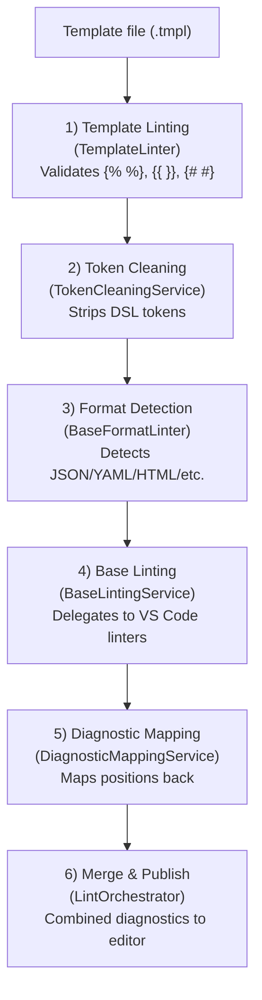

# Temple Linter

A declarative, type-safe transformation engine for structured data that validates and emits your target format.

A Language Server Protocol (LSP) server for linting templated files. Integrates temple core's parser and type checker for comprehensive template validation with base format linting.

## Features

✨ **Syntax Validation**: Parse templates and detect unclosed blocks, malformed expressions  
🔍 **Semantic Validation**: Type checking with schema support (undefined variables, type mismatches)  
🚀 **Performance**: LRU-cached parsing and type checking from temple core  
🎨 **Format Detection**: Automatic detection of JSON, YAML, HTML, XML, TOML, Markdown  
🔌 **VS Code Integration**: Seamless integration with VS Code's native linters  
📊 **Complete Diagnostics**: Combines template and base format diagnostics with accurate position mapping
🧭 **LSP Language Features**: Completion, hover, go-to-definition, find references, and rename

## Dependencies

- **temple>=0.1.0**: Core templating engine with parser, type checker, and diagnostics (REQUIRED)
- **pygls>=1.0.0**: LSP server framework
- **Python 3.10+**: Required by package metadata and CI

## Installation

### Prerequisites

First, install temple core:

```bash
cd ../temple
pip install -e .
```

### Install Temple Linter

```bash
cd ../temple-linter
pip install -e .
```

This will automatically install all dependencies including temple core.

### Verify Installation

```bash
# Verify imports work
python -c "from temple_linter import TypedTemplateParser, Diagnostic; print('✅ Installation successful')"

# Start LSP server (for testing)
python -m temple_linter.lsp_server
```

### Development Setup

For development with live changes:

```bash
# Install both packages in editable mode
cd ../temple && pip install -e .
cd ../temple-linter && pip install -e .

# Install dev dependencies
pip install pytest pytest-cov
```

### VS Code Extension

```bash
cd ../vscode-temple-linter
npm install
npm run compile
# Press F5 in VS Code to launch Extension Development Host
```

## Usage

### Importing Temple Core APIs

Temple-linter re-exports commonly used temple core types for convenience:

```python
from temple_linter import (
    TypedTemplateParser,    # Parse templates
    TypeChecker,            # Type checking
    Diagnostic,             # Error reporting
    DiagnosticSeverity,     # Error levels
    Schema,                 # Schema definitions
    SchemaParser,           # Schema parsing
    Block, Expression,      # AST nodes
    If, For, Include, Text
)

# Parse a template
parser = TypedTemplateParser()
ast, diagnostics = parser.parse("{{ user.name }}")

# Type check with schema
schema = Schema.from_dict({
    "type": "object",
    "properties": {
        "user": {
            "type": "object",
            "properties": {
                "active": {"type": "boolean"},
                "name": {"type": "string"}
            }
        }
    }
})

type_checker = TypeChecker(schema)
type_diagnostics = type_checker.check(ast)
```

## Architecture

The linter uses a service-oriented architecture following the Single Responsibility Principle:

### Workflow



## Usage

### Writing Templates

Temple uses Jinja-like syntax by default:

| Token Type  | Syntax             | Purpose                    |
|-------------|--------------------|----------------------------|
| Statement   | `...`    | Control flow logic         |
| Expression  | `{{ variable }}`   | Variable insertion         |
| Comment     | `{# note #}`       | Template comments          |

### Examples

#### JSON Template (`config.json.tmpl`)

```json
{
  "name": "{{ project.name }}",
  "version": "{{ project.version }}",
  "dependencies": {
    
    "{{ dep }}": "{{ ver }}",
    
  }
}
```

#### YAML Template (`docker-compose.yaml.tmpl`)

```yaml
version: {{ docker.version }}
services:
  
  {{ service.name }}:
    image: {{ service.image }}
    ports:
      
      - "{{ port }}"
      
  
```

#### HTML Template (`page.html.tmpl`)

```html
<!DOCTYPE html>
<html lang="{{ site.lang }}">
<head>
    <title>{{ page.title }}</title>
</head>
<body>
    
    <h1>Welcome, {{ user.name }}!</h1>
    
    <a href="/login">Log in</a>
    
</body>
</html>
```

## Configuration

### VS Code Settings

Configure in `.vscode/settings.json`:

```json
{
  "temple.fileExtensions": [".tmpl", ".template", ".tpl", ".jinja"],
  "python.defaultInterpreterPath": "/path/to/python"
}
```

### Custom Delimiters

Future support for custom delimiters via config:

```yaml
# .temple.yaml (planned)
delimiters:
  statement: ["<<", ">>"]
  expression: ["<:", ":>"]
  comment: ["<#", "#>"]
```

## Supported Formats

| Format   | Extensions          | Detection Heuristics        |
|----------|---------------------|------------------------------|
| JSON     | `.json`             | Starts with `{` or `[`       |
| YAML     | `.yaml`, `.yml`     | Contains `:` patterns       |
| HTML     | `.html`             | `<!DOCTYPE>`, `<html>`       |
| XML      | `.xml`              | `<?xml version`              |
| TOML     | `.toml`             | Starts with `[section]`      |
| Markdown | `.md`               | Starts with `#` headers      |

**Unknown formats** automatically pass through to VS Code for auto-detection (VS Code Passthrough mode).

## Development

### Running Tests

```bash
# All tests
pytest tests/ -q

# Core linting/diagnostics suites
pytest tests/test_preprocessing.py -q
pytest tests/test_base_format_linter.py -q
pytest tests/test_diagnostics.py -q
pytest tests/test_linter.py -q
pytest tests/test_semantic_linter.py -q
pytest tests/test_integration.py -q

# LSP-specific suites
pytest tests/test_lsp_entrypoint.py -q
pytest tests/test_lsp_transport_wiring.py -q
pytest tests/test_lsp_features.py -q

# E2E + performance thresholds
pytest tests/test_e2e_performance.py -q

# With coverage
pytest tests/ --cov=temple_linter --cov-report=html
```

### Test Structure (Auto-Synced)

The tree below is generated from the repository during pre-commit/CI to avoid drift.

<!-- BEGIN:project-structure path=temple-linter/tests depth=2 annotations=temple-linter/.structure-notes.yaml section=tests -->
```text
temple-linter/tests/
├── test_base_format_linter.py          # Base format validation coverage
├── test_base_linting_service.py
├── test_diagnostics.py                 # Diagnostic mapping and reporting coverage
├── test_e2e_performance.py             # E2E and performance guardrails
├── test_integration.py                 # End-to-end linting pipeline coverage
├── test_linter.py
├── test_lsp_entrypoint.py
├── test_lsp_features.py                # Completion/hover/definition/references/rename tests
├── test_lsp_transport_wiring.py
├── test_preprocessing.py
├── test_semantic_linter.py
└── fixtures/                           # Template fixtures for base-format and linting scenarios
    ├── valid_docker_compose.yaml.tmpl
    ├── valid_package.json.tmpl
    ├── valid_page.html.tmpl
    └── valid_README.md.tmpl
```
<!-- END:project-structure -->

### Project Structure

Critical files to know first:

- `src/temple_linter/lsp_server.py` - LSP entry point and feature registration
- `src/temple_linter/lsp_features.py` - completion/hover/definition/references/rename providers
- `src/temple_linter/linter.py` - Temple syntax + semantic linting integration
- `src/temple_linter/services/lint_orchestrator.py` - pipeline coordinator
- `tests/test_integration.py` - broad pipeline coverage
- `tests/test_e2e_performance.py` - E2E and performance thresholds

Generated mini-tree (auto-synced):

<!-- BEGIN:project-structure path=temple-linter depth=2 annotations=temple-linter/.structure-notes.yaml section=project -->
```text
temple-linter/
├── pyproject.toml                    # Package metadata and tooling configuration
├── README.md                         # ⭐ You are here
├── requirements.txt
├── setup.py
├── .benchmarks/
├── .vscode/
│   └── settings.json
├── docs/                             # Sphinx docs and developer guides
│   ├── api.rst
│   ├── conf.py
│   ├── diagnostics_api.md
│   ├── EXTENDING.md
│   ├── index.rst
│   └── _static/
├── src/                              # Python package sources
│   ├── __init__.py
│   └── temple_linter/                # Linter and LSP implementation
├── tests/                            # Test suites and fixtures
│   ├── test_base_format_linter.py
│   ├── test_base_linting_service.py
│   ├── test_diagnostics.py
│   ├── test_e2e_performance.py
│   ├── test_integration.py
│   ├── test_linter.py
│   ├── test_lsp_entrypoint.py
│   ├── test_lsp_features.py
│   ├── test_lsp_transport_wiring.py
│   ├── test_preprocessing.py
│   ├── test_semantic_linter.py
│   └── fixtures/
└── typings/
    ├── temple/
    └── temple_linter/
```
<!-- END:project-structure -->

## Performance

### Regex Caching

Compiled regex patterns are cached using `functools.lru_cache`:

- **Cache size**: 128 patterns (configurable)
- **Cache key**: Delimiter configuration tuple
- **Performance**: 10x+ speedup for batch processing
- **Memory**: Minimal (patterns are small)

### Benchmarks

| Operation                | Time (uncached) | Time (cached) | Speedup |
|--------------------------|-----------------|---------------|---------|
| Tokenize 1000 files      | ~2.5s           | ~0.2s         | 12.5x   |
| Strip tokens 1000 files  | ~1.8s           | ~0.15s        | 12x     |

## Extending

### Adding Custom Format Detectors

Create a detector implementing the `FormatDetector` protocol:

```python
from temple_linter.base_format_linter import FormatDetector, registry

class CustomFormatDetector(FormatDetector):
    def matches(self, filename, content):
        """Return confidence score 0.0-1.0"""
        if filename and filename.endswith('.custom'):
            return 1.0  # Extension match
        if content.startswith('CUSTOM:'):
            return 0.8  # Content heuristic
        return 0.0
    
    def format_name(self):
        return "custom"

# Register with priority (higher = checked first)
registry.register(CustomFormatDetector(), priority=85)
```

See [docs/EXTENDING.md](docs/EXTENDING.md) for complete guide.

## Troubleshooting

### LSP Server Not Starting

**Check Python path:**

```bash
# Verify Python version
python --version  # Should be 3.10+

# Check installed packages
pip list | grep temple-linter
```

**Check VS Code Output:**

- View → Output → Select "Temple LSP" from dropdown
- Look for startup messages or errors

### Diagnostics Not Appearing

1. **Verify file extension**: Must match `temple.fileExtensions` setting
2. **Check LSP connection**: Look for "Temple LSP" client in VS Code
3. **Test with known-good template**: Use examples from `tests/fixtures/`

### Wrong Diagnostic Positions

- **Preserve line structure**: Avoid multiple tokens per line where possible
- **Check token cleaning**: Run `python -m temple_linter.template_preprocessing --strip --input "text"`
- **Enable debug logging**: Set `TEMPLE_LINTER_DEBUG=1` environment variable

### Format Not Detected

1. **Use explicit extension**: `file.json.tmpl` instead of `file.tmpl`
2. **Check detector priorities**: See `base_format_linter.py` registry
3. **Fallback to passthrough**: Unknown formats auto-delegate to VS Code

## API Documentation

Full API documentation generated with Sphinx:

```bash
cd docs
make html
open _build/html/index.html
```

Or view online: [docs/api/](docs/api/)

## Contributing

1. Fork the repository
2. Create feature branch: `git checkout -b feature/my-feature`
3. Add tests: `pytest tests/test_my_feature.py -v`
4. Ensure all tests pass: `pytest tests/ -v`
5. Update documentation
6. Submit pull request

### Code Standards

- **Type hints**: Required for public APIs
- **Docstrings**: Google style (parsed by Sphinx napoleon)
- **Tests**: Minimum 80% coverage for new code
- **Formatting**: Follow existing patterns (PEP 8)

## License

MIT License - See [LICENSE](LICENSE) file for details

## Related Projects

- **temple/** - Core rendering engine (separate component)
- **vscode-temple-linter/** - VS Code extension companion
- **Temple Language Spec** - See `../temple/docs/syntax_spec.md`

## Credits

Built with:

- [pygls](https://github.com/openlawlibrary/pygls) - LSP framework
- [lsprotocol](https://github.com/microsoft/lsprotocol) - LSP types
- [pytest](https://pytest.org/) - Testing framework
- [Sphinx](https://www.sphinx-doc.org/) - Documentation

## Status

**Version**: 0.1.0  
**Stability**: MVP in active iteration

### Completed Features

- ✅ LSP server with service architecture
- ✅ Syntax + semantic diagnostics integration
- ✅ Base linting delegation and mapped diagnostics
- ✅ Completion, hover, definition, references, and rename
- ✅ Configurable Temple file extensions
- ✅ E2E and performance-threshold test coverage
- ✅ API documentation (Sphinx)
- ✅ Real-world template fixtures

### Roadmap

- [ ] Multi-file rename/definition beyond single-document scope
- [ ] Richer schema auto-discovery in LSP initialization
- [ ] Performance profiling with larger real-world fixture sets
- [ ] VS Code extension marketplace publication

## Support

- **Documentation**: [docs/](docs/)
- **Issues**: GitHub Issues
- **Tests**: `pytest tests/ -v`
- **Examples**: `tests/fixtures/`
