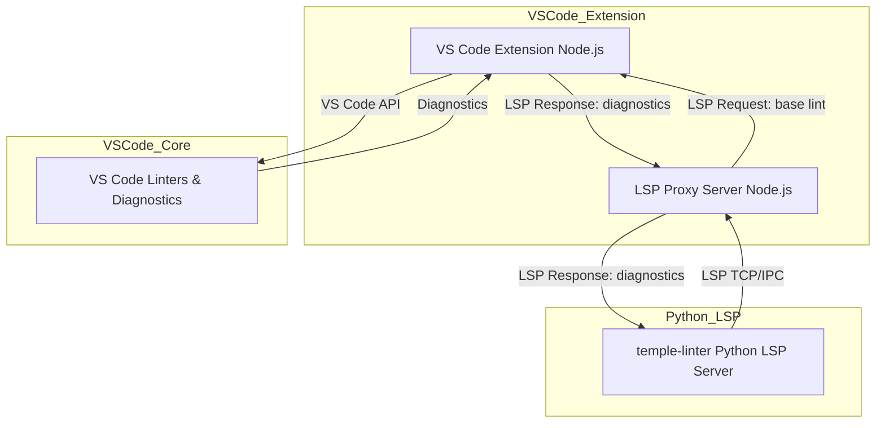

# Temple Linter VS Code Integration Architecture

## Overview
This document describes the architecture for integrating the `temple-linter` Python LSP server with a VS Code extension, using a Node.js LSP proxy to delegate base linting requests back to VS Code's in-process linters.

---

## Components
- **temple-linter (Python):** Runs as a standalone LSP server. Handles template linting and delegates base linting via LSP.
- **VS Code Extension (Node.js):** Starts a local LSP proxy server.
- **LSP Proxy Server (Node.js):** Implements LSP, listens for requests from temple-linter, delegates base linting to VS Code APIs, and returns diagnostics.
- **VS Code Linters:** Provide diagnostics via the VS Code API.

---

## Architecture Diagram



---

## Sequence Diagram

```mermaidmermaid
sequenceDiagram
    participant VSCode as VS Code Extension
    participant Proxy as LSP Proxy Server
    participant Linters as VS Code Linters
    participant Temple as temple-linter (Python LSP)

    Temple->>Proxy: LSP Request (base lint)
    Proxy->>VSCode: Forward base lint request
    VSCode->>Linters: Run diagnostics
    Linters-->>VSCode: Diagnostics
    VSCode-->>Proxy: Diagnostics
    Proxy-->>Temple: LSP Response (diagnostics)
```

---

## Implementation Outline

1. **temple-linter (Python)**
   - Use pygls or similar to implement a full LSP server.
   - For base linting, send a custom LSP request (e.g., temple/baseLint) to the client.
   - Merge template and base diagnostics, return via LSP.

2. **VS Code Extension**
   - Start an LSP proxy server (using vscode-languageserver/node).
   - Register a handler for temple/baseLint.
   - When a base lint request is received, use VS Code APIs to run diagnostics on the provided text.
   - Return diagnostics to the LSP client (temple-linter).

3. **LSP Proxy Server**
   - Acts as a bridge between temple-linter and VS Code APIs.
   - Handles all LSP communication and request routing.

---

## Benefits
- Fully decoupled, editor-agnostic Python linter.
- Robust, extensible, and standards-based communication using LSP.
- Reusable architecture for other editors and tools.
