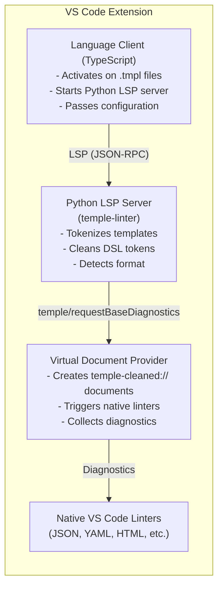

# Temple Linter - VS Code Extension

Language support for Temple templated files with integrated linting and diagnostics.

## Features

- **Syntax Highlighting**: Template-aware syntax highlighting for temple blocks (``, `{{ }}`, `{# #}`) in `.tmpl` and `.template` files
- **Intelligent Linting**: Validates both template syntax and base format
- **Format Detection**: Auto-detects JSON, YAML, HTML, XML, TOML, Markdown
- **Native Linter Integration**: Delegates to VS Code's built-in linters
- **Configurable Extensions**: Customize recognized temple file extensions
- **Real-time Diagnostics**: Instant feedback as you type

Syntax grammar maintenance note:

- `syntaxes/templated-any.tmLanguage.json` and `syntaxes/temple.injection.tmLanguage.json` are generated from a shared source script: `scripts/generate-syntaxes.js`.
- Run `npm run generate:syntaxes` (or `npm run compile`) after grammar changes.

## Installation

### From Source

1. **Install Python LSP Server:**

   ```bash
   cd ..
   ./scripts/setup-hooks.sh
   ./.ci-venv/bin/pip install -e ./temple[dev,ci]
   ./.ci-venv/bin/pip install -e ./temple-linter[dev,ci]
   cd vscode-temple-linter
   ```

2. **Build Extension:**

   ```bash
   npm install
   npm run compile
   ```

3. **Run in Development:**
   - Press `F5` in VS Code to launch Extension Development Host
   - Open a `.tmpl` file to activate

4. **Package for Installation:**

   ```bash
   npm install -g vsce
   npm run package:check
   vsce package
   # Install the generated .vsix file
   ```

### Publish Flow (MVP)

1. Ensure `package.json` metadata is publish-ready (`name`, `publisher`, `repository`, `license`, `version`).
2. Validate packaging locally:

   ```bash
   npm run compile
   npm run lint
   npm run package:check
   vsce package
   ```

3. Install locally for smoke verification:

   ```bash
   code --install-extension vscode-temple-linter-0.0.4.vsix
   ```

4. Publish when ready:

   ```bash
   vsce publish
   ```

## Configuration

### Settings

Configure in `.vscode/settings.json` or User Settings:

```json
{
  "temple.fileExtensions": [".tmpl", ".template", ".tpl", ".jinja"],
  "temple.semanticSchemaPath": "schemas/template.schema.json",
  "temple.semanticContext": {
    "user": { "name": "Alice" }
  },
  "temple.baseLintStrategyMode": "auto",
  "temple.embeddedBaseLintFormats": [],
  "temple.baseLintLogLevel": "warn",
  "temple.pythonPath": "/path/to/python",
  "temple.serverRoot": "/path/to/temple-linter",
  "python.defaultInterpreterPath": "/path/to/python"
}
```

### Settings Reference

| Setting                         | Type   | Default                  | Description                          |
|---------------------------------|--------|--------------------------|--------------------------------------|
| `temple.fileExtensions`         | array  | `[".tmpl", ".template"]` | File extensions treated as templates |
| `temple.semanticSchemaPath`     | string | `""`                     | Optional JSON Schema path for semantic validation/features |
| `temple.semanticContext`        | object | `{}`                     | Optional semantic context object for runtime-like validation |
| `temple.baseLintStrategyMode`   | string | `"auto"`                 | Base-lint strategy mode: `auto`, `embedded`, `vscode` |
| `temple.embeddedBaseLintFormats`| array  | `[]`                     | Formats with embedded adapters available to Temple |
| `temple.baseLintLogLevel`       | string | `"warn"`                 | Base-lint bridge log verbosity (`error`..`trace`) |
| `temple.pythonPath`             | string | `""`                     | Optional explicit Python path for Temple Language Server server |
| `temple.serverRoot`             | string | `""`                     | Optional temple-linter root path used as LSP server cwd |
| `python.defaultInterpreterPath` | string | `"python"`               | Path to Python interpreter           |

## Usage

### Creating Template Files

Create files with `.tmpl` or `.template` extensions:

- `config.json.tmpl` - JSON template
- `app.yaml.tmpl` - YAML template  
- `index.html.tmpl` - HTML template
- `README.md.tmpl` - Markdown template

### Template Syntax

Temple uses Jinja-like syntax:

```temple
...   # Statements
{{ variable }}                      # Expressions
{# comment #}                       # Comments
```

Autocomplete notes:

- Statement keyword completions (for `if`, `for`, `include`, etc.) work in ``.
- Variable/property completions in `{{ ... }}` require either `temple.semanticSchemaPath` or `temple.semanticContext`.

### Example: JSON Template

Create `package.json.tmpl`:

```json
{
  "name": "{{ project.name }}",
  "version": "{{ project.version }}",
  "dependencies": {
    
    "{{ dep }}": "{{ ver }}",
    
  }
}
```

The extension will:

1. ✅ Validate template syntax (``, `{{ }}` matching)
2. ✅ Strip template tokens
3. ✅ Validate JSON structure
4. ✅ Show combined diagnostics

### Example: YAML Template

Create `config.yaml.tmpl`:

```yaml
database:
  host: {{ db.host }}
  port: {{ db.port }}
  credentials:
    username: {{ db.user }}
    password: {{ db.password }}
servers:
  
  - name: {{ server.name }}
    url: {{ server.url }}
  
```

## Supported Formats

| Format   | Extensions          | Linter Integration        |
|----------|---------------------|---------------------------|
| JSON     | `.json`             | VS Code JSON Schema       |
| YAML     | `.yaml`, `.yml`     | YAML Language Support     |
| HTML     | `.html`             | VS Code HTML              |
| XML      | `.xml`              | XML Language Support      |
| TOML     | `.toml`             | Even Better TOML          |
| Markdown | `.md`               | VS Code Markdown          |

Unknown formats automatically pass through to VS Code for detection.

## Features in Detail

### Template Linting

Validates template-specific syntax:

- Unclosed blocks: `` without ``
- Invalid statements: ``
- Malformed expressions: `{{ unclosed`
- Mismatched delimiters

### Base Format Linting

Delegates to native VS Code linters:

- JSON: Validates JSON schema, detects syntax errors
- YAML: Validates YAML structure, indentation
- HTML: Validates HTML5 standards, accessibility
- XML: Validates well-formedness
- And more...

### Diagnostic Position Mapping

Accurately maps diagnostics from cleaned content back to original template:

```text
Original:    1: {
             2:   "name": "{{ project.name }}",
             3:   "invalid": true true
             4: }

Cleaned:     1: {
             2:   "name": "",
             3:   "invalid": true true    <-- Error here
             4: }

Diagnostic:  Line 3: Duplicate value
```

The extension correctly reports the error at line 3 in the original template.

### Semantic Diagnostic Codes

Semantic diagnostics from `temple-type-checker` use these stable codes:

- `undefined_variable`
- `missing_property`
- `type_mismatch`
- `schema_violation`

## Extension Architecture

<!-- BEGIN:project-structure -->

<!-- END:project-structure -->

## Troubleshooting

### Extension Not Activating

**Check file extension:**

- File must end with `.tmpl` or `.template` (or custom configured extension)
- Verify `temple.fileExtensions` setting

**Check language ID:**

- Bottom-right corner of VS Code should show "Templated File"
- Click to manually select language if incorrect
- If another extension claims `.tmpl` (for example Go templates), force Temple association:

  ```json
  {
    "files.associations": {
      "*.tmpl": "templated-any",
      "*.template": "templated-any"
    }
  }
  ```

### No Diagnostics Appearing

1. **Check Output Panel:**
   - View → Output → Select "Temple Language Server"
   - Look for connection errors

2. **Verify Python Server:**

   ```bash
   # Test LSP server manually
   cd ../temple-linter
   python -m temple_linter.lsp_server
   ```

3. **Check Python Path:**
   - Ensure `temple.pythonPath` or `python.defaultInterpreterPath` is correct
   - Python 3.10+ required

### Incorrect Diagnostic Positions

- **Template structure**: Keep templates line-oriented when possible
- **Debug mode**: Set `TEMPLE_LINTER_DEBUG=1` for verbose logging
- **Report issue**: Include template and diagnostic positions

### Performance Issues

- **Large files**: Consider breaking into smaller templates
- **Many templates**: Regex caching should help (automatic)
- **Disable temporarily**: Close/reopen file to restart

## Development

### Build from Source

```bash
# Install dependencies
npm install

# Compile TypeScript
npm run compile

# Watch mode (auto-compile)
npm run watch

# Launch Extension Development Host
# Press F5 in VS Code
```

### Project Structure

Critical files to know first:

- `src/extension.ts` - VS Code extension activation + LanguageClient wiring
- `package.json` - extension manifest, activation events, language contributions
- `tsconfig.json` - TypeScript compiler configuration
- `language-configuration.json` - editor behavior for templated files

Generated mini-tree (auto-synced):

<!-- BEGIN:project-structure path=vscode-temple-linter depth=2 annotations=vscode-temple-linter/.structure-notes.yaml -->
```text
vscode-temple-linter/
├── .eslintrc.cjs                         # ESLint configuration
├── .vscodeignore
├── ARCHITECTURE.md
├── language-configuration.json           # Editor behavior for templated files
├── package-lock.json
├── package.json                          # Extension manifest and VS Code contributions
├── README.md                             # ⭐ You are here
├── test_sample.json.tmpl
├── tsconfig.json                         # TypeScript compiler configuration
├── scripts/
│   └── generate-syntaxes.js
├── src/                                  # Extension source code
│   └── extension.ts                      # LanguageClient bootstrap and LSP wiring
├── syntaxes/
│   ├── templated-any.tmLanguage.json
│   └── temple.injection.tmLanguage.json
└── test/
    ├── runTest.js
    └── suite/
```
<!-- END:project-structure -->

## Known Limitations

- **Custom delimiters**: Not yet configurable via extension (Python-side ready)
- **Nested templates**: Complex nesting may affect position mapping
- **Binary formats**: Text-based formats only

## Roadmap

- [ ] Custom delimiter configuration UI
- [ ] Template snippets and autocomplete
- [ ] Hover documentation for template variables
- [ ] Go-to-definition for template references
- [ ] Marketplace publication

## Contributing

See [CONTRIBUTING.md](../CONTRIBUTING.md) for guidelines.

### Testing Extension

1. Open workspace in VS Code
2. Press F5 to launch Extension Development Host
3. Create test file: `test.json.tmpl`
4. Verify linting and diagnostics

## License

MIT License - See [LICENSE](../LICENSE) file

## Related

- **temple-linter** - Python LSP server backend
- **temple** - Core rendering engine
- **Temple Docs** - See `../temple/docs/`

## Support

- **Issues**: Report on GitHub
- **Documentation**: See `../temple-linter/docs/`
- **Examples**: See `../temple-linter/tests/fixtures/`
